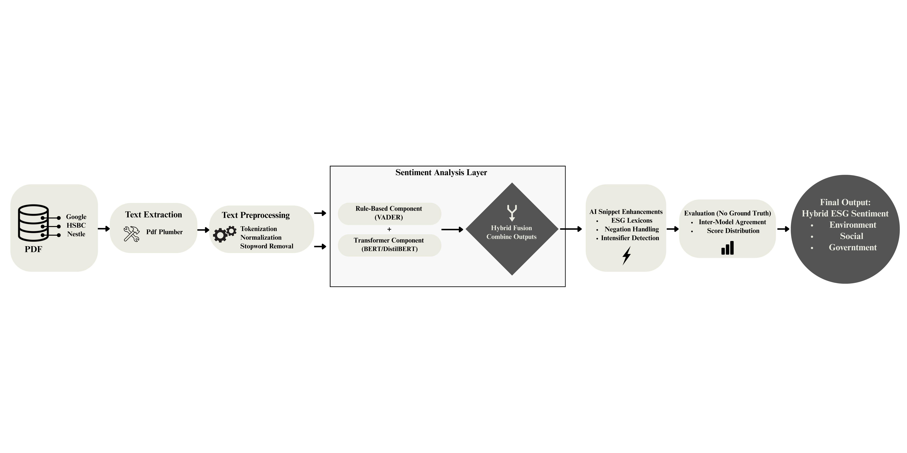

# Hybrid ESG Sentiment Analysis in Corporate Sustainability Reports: Integrating Transformers with Snippet-Based Lexicon Features

This repository contains the code and data preparation pipeline for our bachelor thesis project on hybrid ESG sentiment analysis in corporate sustainability reports.

## 📊 Pipeline Flowchart



## Repository Structure
```
├── data/
│   ├── raw_reports/                          # Extracted .txt files (starting point of pipeline)
│   │   ├── Google 2022.txt
│   │   ├── Google 2023.txt
│   │   ├── Google 2024.txt
│   │   ├── HSBC 2022.txt
│   │   ├── HSBC 2023.txt
│   │   ├── HSBC 2024.txt
│   │   ├── Nestle 2022.txt
│   │   ├── Nestle 2023.txt
│   │   └── Nestle 2024.txt
│   └── cleaned_v2/
│       ├── combined_corpus.jsonl             # Cleaned corpus with company/year/text
│       ├── preprocessed_corpus.jsonl         # Sentence-level corpus (for BERT)
│       └── preprocessed_with_lemma.jsonl     # Lemmatized/token corpus (for lexicon & snippet analysis)
├── notebooks/
│   ├── 01_data_cleaning_and_corpus.ipynb     # Cleaning and corpus creation
│   └── 02_preprocessing.ipynb                # Preprocessing: normalization, sentence splitting, lemma
├── requirements.txt
└── README.md
```

## Pipeline Overview
1. **Data Cleaning & Corpus Creation**
   - Extracted 9 sustainability reports (Google, HSBC, Nestlé; 2022–2024).
   - **Note:** Original PDF reports are *not* included in this repository due to copyright restrictions.  
     - They are publicly available on the companies' websites.  
     - The pipeline starts from the already extracted `.txt` files under `data/raw_reports/`.  
   - From these `.txt` files, we create a structured JSONL corpus with `company`, `year`, `file`, and `text`.

2. **Preprocessing**
   - Normalization (lowercasing, number/unit handling).
   - Sentence splitting (for transformer input).
   - Stopword removal + lemmatization (for lexicon/snippet analysis).

## Current Status
- ✅ Data cleaning completed.  
- ✅ Corpus structured and validated.  
- ✅ Preprocessing completed (sentence-level + lemmatized corpora).  

## Next Steps
- Baseline sentiment analysis with DistilBERT/BERT.  
- Snippet integration (ESG-specific lexicons, negation handling, intensifiers).  
- Evaluation (distributional analysis, inter-model agreement, case studies).  

---

### 📌 Reproducibility Note
This repository is designed to be fully reproducible **starting from the extracted `.txt` files** provided in `data/raw_reports/`.  
Anyone cloning this repository can run the notebooks step by step and obtain the same corpora and preprocessing outputs, without needing the original PDF files.
