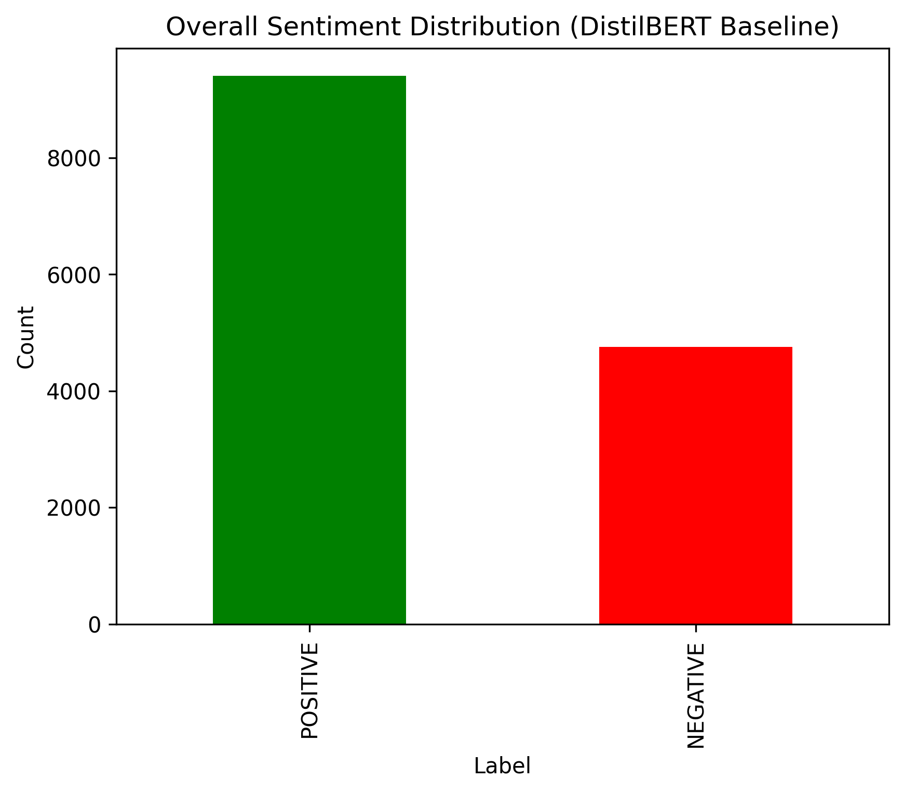
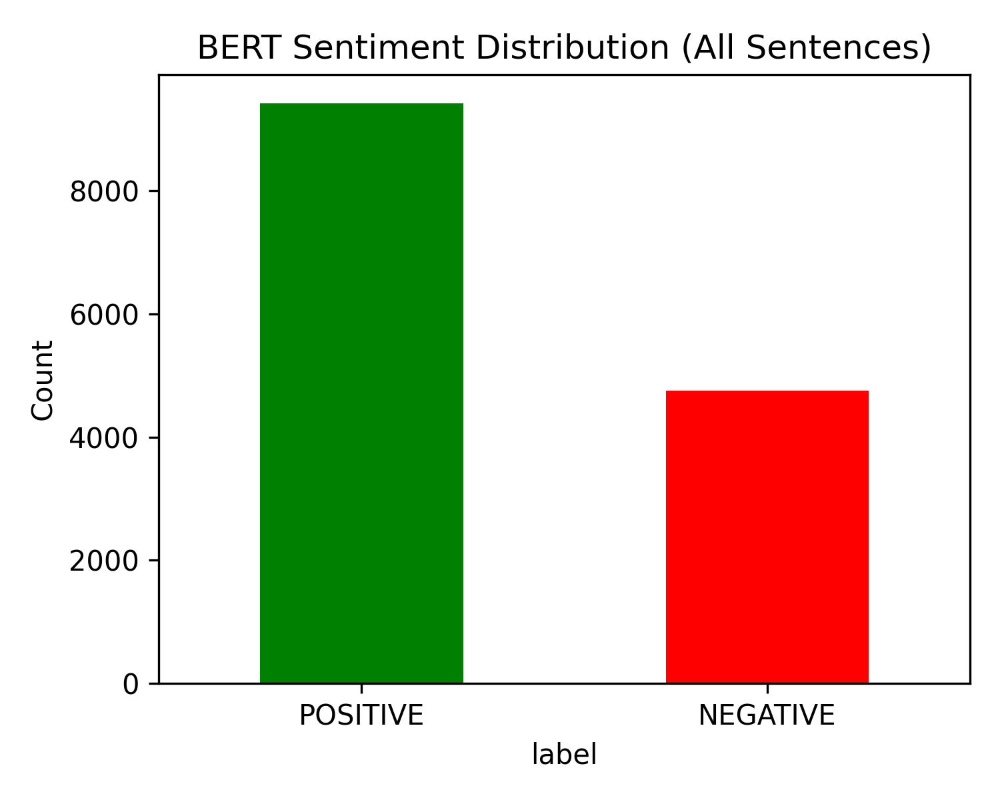
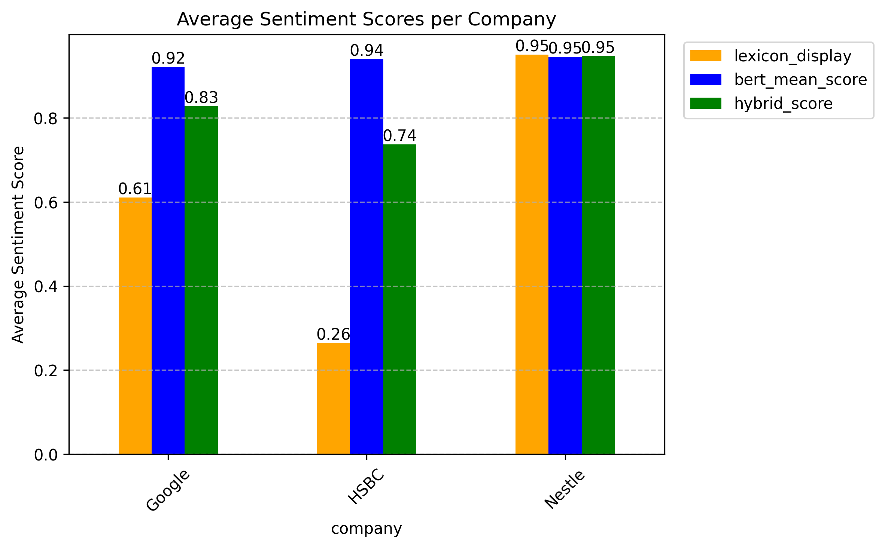
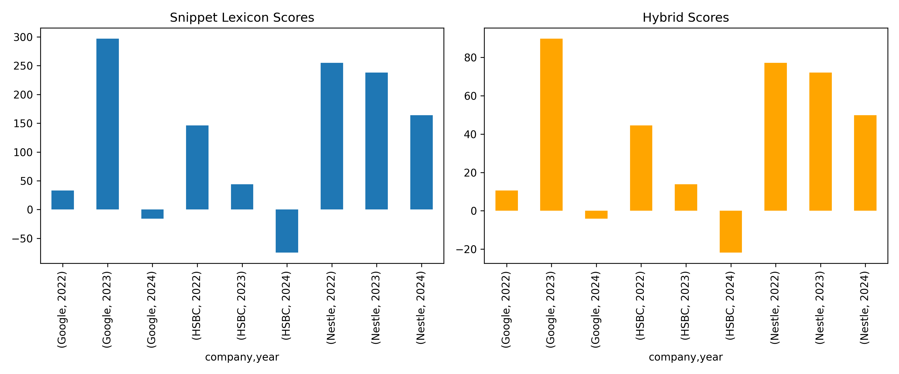
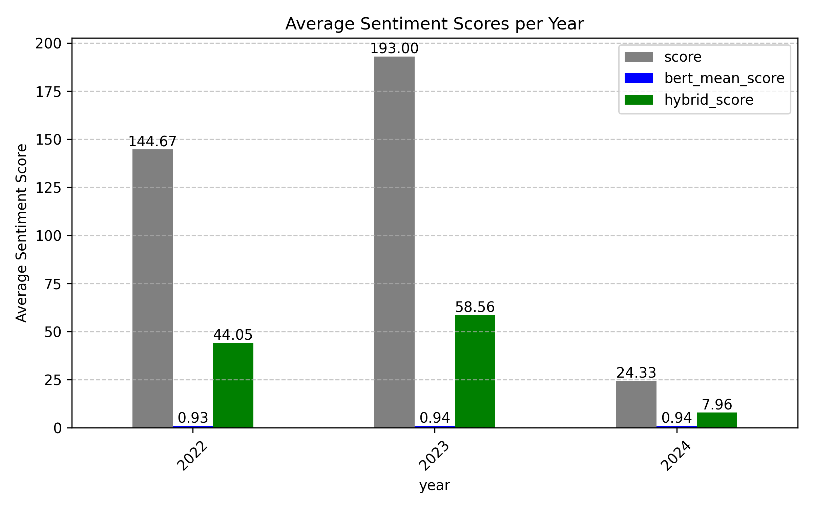

# Hybrid ESG Sentiment Analysis in Corporate Sustainability Reports

This project implements a **Hybrid NLP Approach** for sentiment analysis in ESG (Environmental, Social, Governance) corporate sustainability reports. It combines **transformer-based models (BERT/DistilBERT)** with **snippet-level lexicon features** to improve sentiment detection in domain-specific contexts.

---

## 📂 Repository Structure
```
├── data/
│   ├── raw_reports/          # Extracted raw TXT files from company PDFs
│   ├── cleaned_v2/           # Deep cleaned text and corpus files
│   ├── processed/            # Baseline, snippet, and hybrid sentiment outputs
├── notebooks/
│   ├── 01_data_cleaning_and_corpus.ipynb
│   ├── 02_preprocessing.ipynb
│   ├── 03_baseline_distilbert.ipynb
│   ├── 03a_baseline_analysis.ipynb
│   ├── 04_snippet_lexicons.ipynb
│   ├── 05_hybrid_fusion.ipynb
│   ├── 06_evaluation.ipynb
├── images/                   # Flowchart & evaluation visualizations
├── README.md
├── requirements.txt
├── LICENSE
```

---

## 🚀 Methodology Overview

### 1. Data Source & Extraction
- Corporate sustainability reports (Google, HSBC, Nestlé, 2022–2024).  
- Extracted into TXT format using **PDFPlumber**.

### 2. Preprocessing
- Cleaning: removed headers, footers, page numbers, ToC.  
- Tokenization, normalization, stopword removal, lemmatization.  
- Dual corpus design:
  - Sentence-level corpus (for transformers, no lemmatization).  
  - Lemmatized corpus (for lexicon/snippet analysis).  

### 3. Baseline Modeling
- Transformer-based sentiment (DistilBERT).  
- **Notebook:** `03_baseline_distilbert.ipynb`  
- Output saved in `data/processed/distilbert_baseline.csv`.

### 4. Baseline Analysis
- Visualized overall sentiment distribution and breakdown by company/year.  
- **Notebook:** `03a_baseline_analysis.ipynb`  
- Example:  
  

### 5. Snippet Lexicon Analysis
- Custom ESG lexicons, negation handling, and intensifier detection.  
- Scores aggregated at document/company level.  
- **Notebook:** `04_snippet_lexicons.ipynb`  

### 6. Hybrid Fusion
- Combined transformer predictions with snippet scores.  
- Produced **hybrid ESG sentiment score** for each company/year.  
- **Notebook:** `05_hybrid_fusion.ipynb`  

### 7. Evaluation
- Compared BERT, snippet, and hybrid results.  
- Metrics: distribution patterns, inter-model agreement.  
- **Notebook:** `06_evaluation.ipynb`  

Key evaluation charts:  
- Sentiment distribution (BERT):  
    
- Average scores per company:  
    
- Document-level comparison:  
    
- Average scores per year:  
    

---

## 📊 Current Outputs
- **DistilBERT baseline sentiment predictions** (`distilbert_baseline.csv`)  
- **Snippet lexicon scores** (`snippet_scores.csv`)  
- **Hybrid fusion scores** (`hybrid_scores.csv`)  
- **Evaluation plots** (see `images/` folder)  

---

## ⚠️ Limitations
- **Bias in transformer models**: pretrained on general-domain corpora, not ESG-specific.  
- **Long sentence handling**: BERT requires chunking for >512 tokens.  
- **Dataset size**: limited to 9 reports (3 companies × 3 years). Expanding improves generalizability.  
- **Lexicon coverage**: ESG dictionaries may miss novel or company-specific terminology.  

---

## 📌 Future Work
- Expand dataset with more companies/reports.  
- Refine ESG-specific lexicons.  
- Introduce weighting strategies in hybrid fusion.  
- Explore evaluation with weak supervision / expert validation.  

---

## ⚖️ License
This project is licensed under the MIT License. See [LICENSE](LICENSE) for details.

