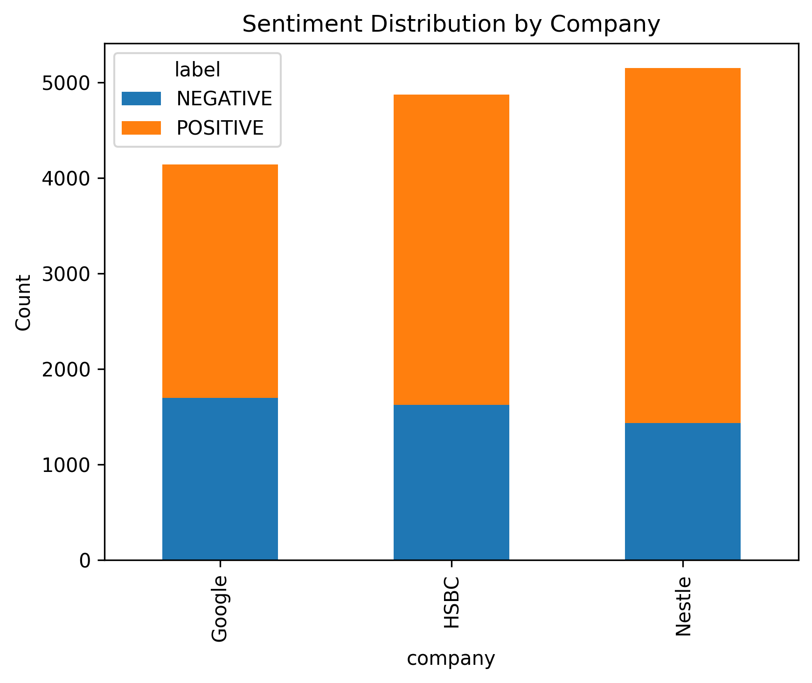
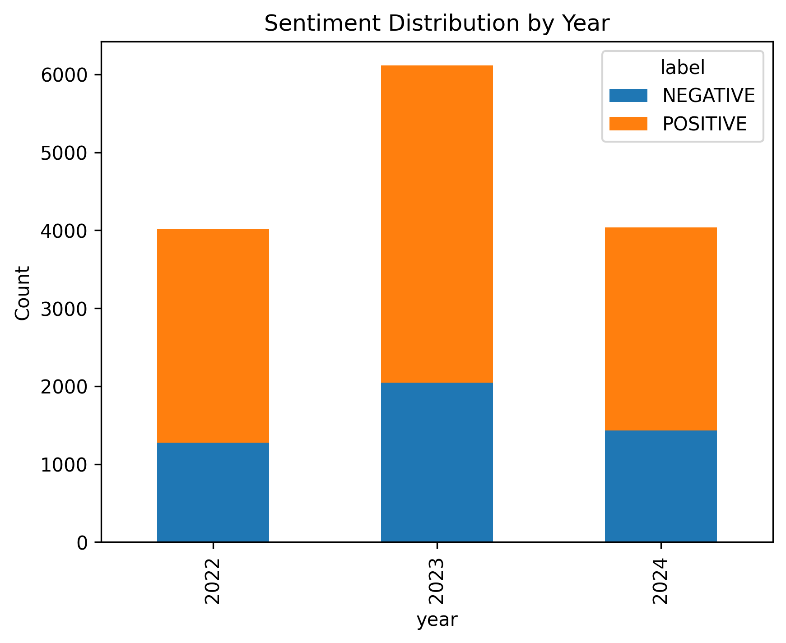
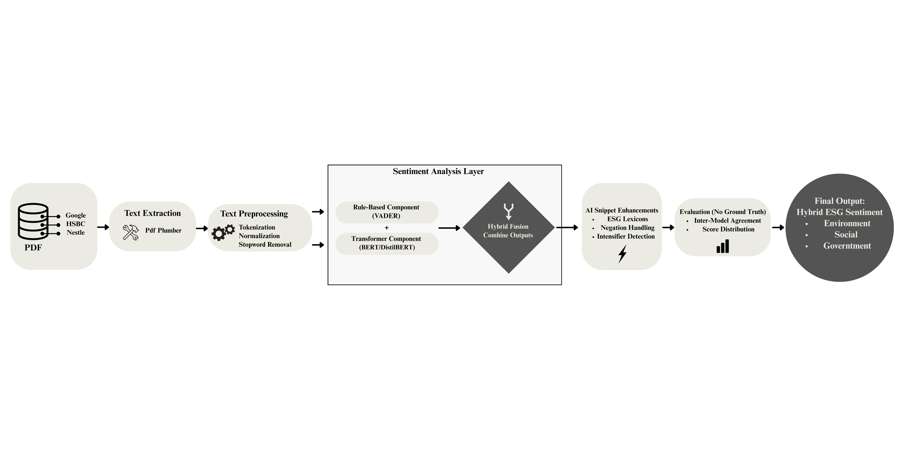

# Hybrid ESG Sentiment Analysis in Corporate Sustainability Reports
Integrating Transformers with Snippet-Based Lexicon Features

## Overview
This project explores hybrid ESG sentiment analysis by combining transformer-based models (DistilBERT) with snippet-based lexicon features.  
The goal is to enhance interpretability and accuracy in analyzing corporate sustainability reports (Google, HSBC, Nestlé).

## Project Structure
- `data/raw_reports/` → Extracted raw text files from PDF reports  
- `data/cleaned_v2/` → Cleaned and normalized text data  
- `data/processed/` → Processed outputs (e.g., baseline predictions CSV)  
- `notebooks/` → Jupyter notebooks for each stage  
- `images/` → Flowcharts and visualizations  

## Current Progress
- ✅ Data extraction (9 sustainability reports → TXT)  
- ✅ Cleaning (deep cleaning of headers, footers, TOCs, page numbers)  
- ✅ Corpus creation (structured JSONL with company + year metadata)  
- ✅ Preprocessing (stopword removal, lemmatization)  
- ✅ DistilBERT baseline inference (sentence-level sentiment analysis, chunking for long sequences)  
- ✅ Baseline analysis (overall, company-level, year-level distributions)  
- ✅ Baseline predictions CSV (`data/processed/distilbert_baseline.csv`) available  

### Next Steps
- 🚧 Snippet and lexicon integration (ESG lexicons, negation & intensifier handling)  
- 🚧 Hybrid model fusion (combine transformer outputs with snippet features)  
- 🚧 Evaluation (distributional analysis, inter-model agreement)  

## Baseline Analysis Results

### Overall Sentiment Distribution


### Sentiment by Company


### Sentiment by Year


## Flowchart


## Requirements
See `requirements.txt` for dependencies.  
Install with:  
```bash
pip install -r requirements.txt
```

## License
MIT License
